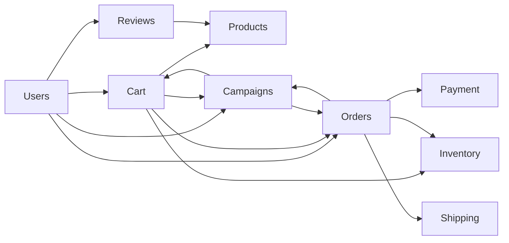

# Proyecto de Microservicios para E-commerce


## Definición de requerimientos por microservicio
| # | Microservicio | Responsabilidad principal | Desafío académico |
|---|---|---|---|
| 1 | Users (Identity) | Registro, login, Roles (JWT). | Seguridad y RBAC. |
| 2 | Products (Catalog) | Gestión de catálogo, categorías, imágenes. | Consultas rápidas / Caché. |
| 3 | Inventory (Stock) | Existencias físicas, entradas y salidas. | Consistencia de datos. |
| 4 | Cart (Basket) | Carrito temporal (Redis o memoria). | Manejo de sesiones / TTL. |
| 5 | Orders (Sales) | Orquestación de la venta y estados del pedido. | Máquina de estados. |
| 6 | Payment (Finance) | Integración (simulada) con pasarelas. | Transaccionalidad y Reintentos. |
| 7 | Shipping (Logistics) | Cálculo de costos de envío y seguimiento. | Algoritmos de rutas / APIs externas. |
| 8 | Reviews (Social) | Valoraciones y comentarios de productos. | Gestión de contenido / Moderación. |
| 9 | Campaigns (Marketing) | Cupones de descuento y promociones. | Lógica de reglas de negocio. |

## Interacción entre microservicios



## Puertos por microservicio

| # | Microservicio | Puerto |
|---|---|---|
| 1 | Users (Identity) | 8081 |
| 2 | Products (Catalog) | 8082 |
| 3 | Inventory (Stock) | 8083 |
| 4 | Cart (Basket) | 8084 |
| 5 | Orders (Sales) | 8085 |
| 6 | Payment (Finance) | 8086 |
| 7 | Shipping (Logistics) | 8087 |
| 8 | Reviews (Social) | 8088 |
| 9 | Campaigns (Marketing) | 8089 |

## Documentación OpenAPI y Swagger

| # | Microservicio | OpenAPI JSON | Swagger UI |
|---|---|---|---|
| 1 | Users | `http://localhost:8081/users/openapi` | `http://localhost:8081/users/docs` |
| 2 | Products | `http://localhost:8082/products/openapi` | `http://localhost:8082/products/docs` |
| 3 | Inventory | `http://localhost:8083/inventory/openapi` | `http://localhost:8083/inventory/docs` |
| 4 | Cart | `http://localhost:8084/cart/openapi` | `http://localhost:8084/cart/docs` |
| 5 | Orders | `http://localhost:8085/orders/openapi` | `http://localhost:8085/orders/docs` |
| 6 | Payment | `http://localhost:8086/payment/openapi` | `http://localhost:8086/payment/docs` |
| 7 | Shipping | `http://localhost:8087/shipping/openapi` | `http://localhost:8087/shipping/docs` |
| 8 | Reviews | `http://localhost:8088/reviews/openapi` | `http://localhost:8088/reviews/docs` |
| 9 | Campaigns | `http://localhost:8089/campaigns/openapi` | `http://localhost:8089/campaigns/docs` |

## Endpoints base (CRUD)

| # | Microservicio | Endpoint GET (listar) |
|---|---|---|
| 1 | Users | `http://localhost:8081/users/api/users` |
| 2 | Products | `http://localhost:8082/products/api/products` |
| 3 | Inventory | `http://localhost:8083/inventory/api/inventories` |
| 4 | Cart | `http://localhost:8084/cart/api/carts` |
| 5 | Orders | `http://localhost:8085/orders/api/orders` |
| 6 | Payment | `http://localhost:8086/payment/api/payments` |
| 7 | Shipping | `http://localhost:8087/shipping/api/shipments` |
| 8 | Reviews | `http://localhost:8088/reviews/api/reviews` |
| 9 | Campaigns | `http://localhost:8089/campaigns/api/campaigns` |

## Ejemplos de consumo

### Ejemplos con curl

```bash
curl -s http://localhost:8081/users/api/users
curl -s http://localhost:8082/products/api/products
curl -s http://localhost:8083/inventory/api/inventories
```

### Respuestas esperadas (data semilla)

`GET /users/api/users`

```json
[
  {
	"id": 1,
	"username": "admin",
	"email": "admin@ecommerce.dev",
	"role": "ADMIN",
	"active": true
  },
  {
	"id": 2,
	"username": "buyer01",
	"email": "buyer01@ecommerce.dev",
	"role": "CUSTOMER",
	"active": true
  }
]
```

`GET /products/api/products`

```json
[
  {
	"id": 1,
	"name": "Laptop Pro 14",
	"category": "Computing",
	"price": 1499.99,
	"active": true
  },
  {
	"id": 2,
	"name": "Auriculares Wireless",
	"category": "Audio",
	"price": 129.90,
	"active": true
  }
]
```

`GET /inventory/api/inventories`

```json
[
  {
	"id": 1,
	"productId": 1,
	"quantity": 25,
	"warehouseCode": "WH-BOG-01"
  },
  {
	"id": 2,
	"productId": 2,
	"quantity": 80,
	"warehouseCode": "WH-MDE-01"
  }
]
```
---
